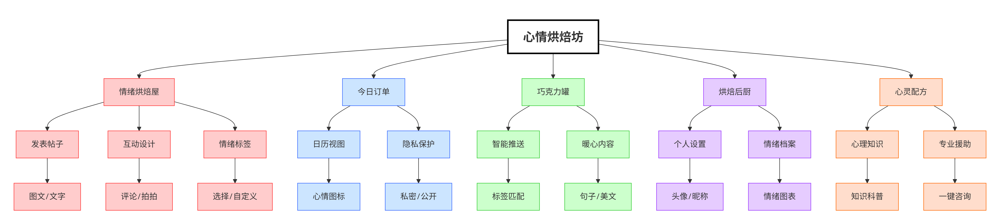
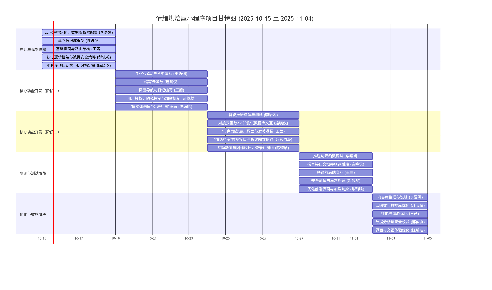
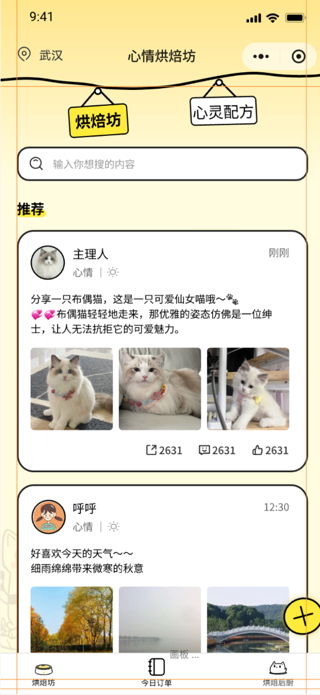
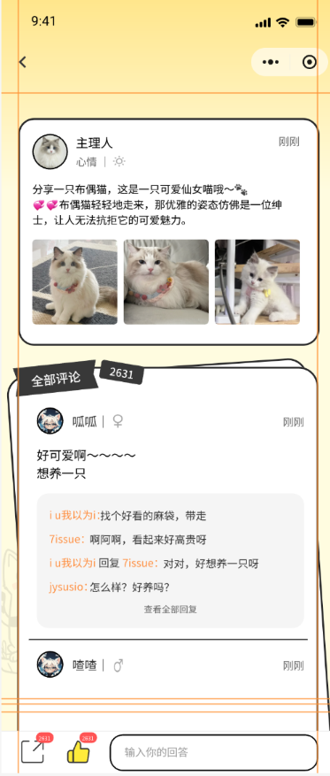
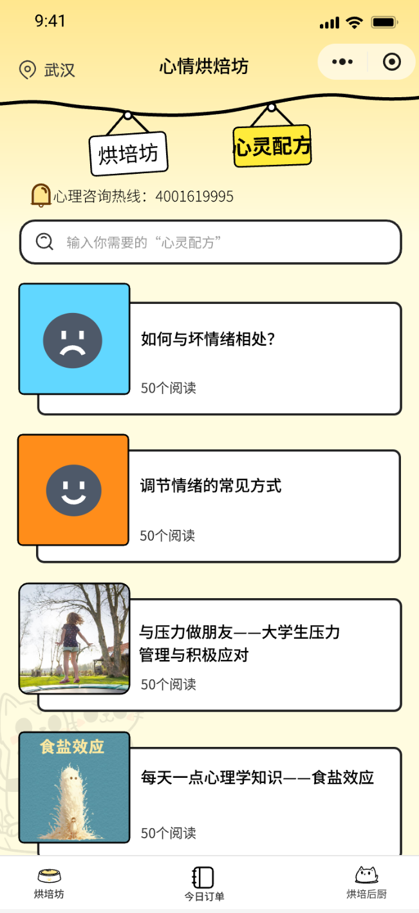
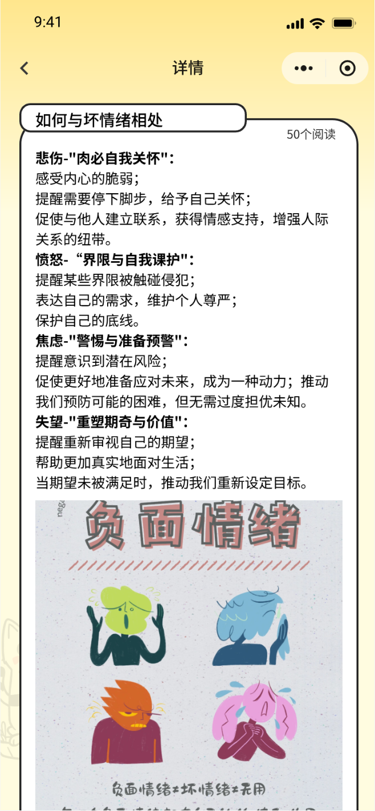
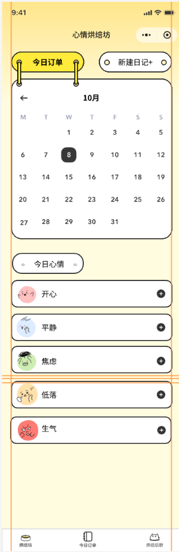
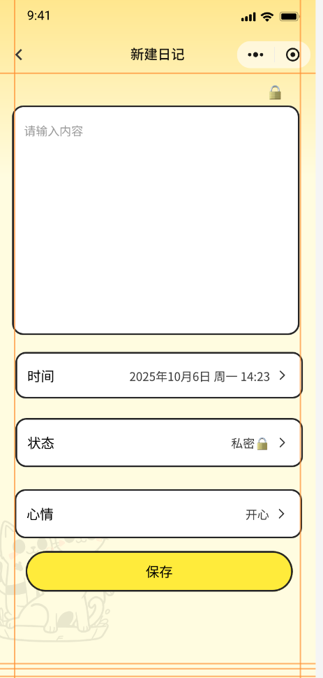
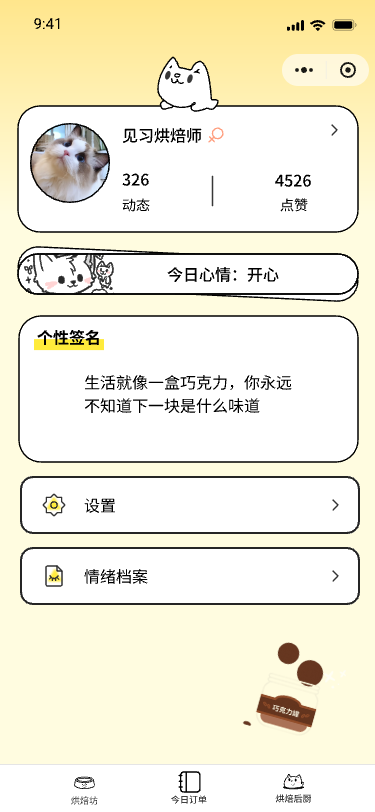
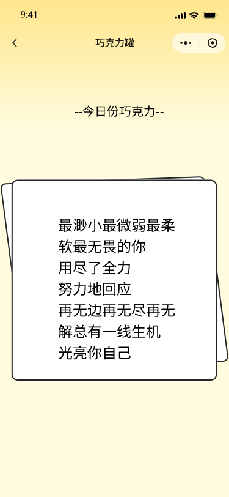

### **心情烘焙坊 - NABCD模型分析**

#### **1. N (Need 需求)**

用户在使用传统社交媒体（如朋友圈、微博）时，常常面临**压力**：需要精心修饰内容、担心他人看法、环境嘈杂负面信息多。用户深层需求是：

*   **安全、私密的表达需求：** 需要一个无压力、不被他人随意评判的空间，记录真实情绪和想法，提供日记功能来满足需求。
*   **寻求共鸣与温暖的需求：** 在情绪低落或迷茫时，希望看到他人的相似经历或得到温暖的鼓励，而非说教，帖子互动和心灵鸡汤推送满足了这一点。
*   **自我梳理与成长的需求：** 通过书写（博客、日记）来整理思绪，是一种有效的心理疗愈方式。
*   **个性化展示的需求：** 用户希望在一个属于自己的小天地里，展现独特的自我，个人空间设置满足了这一需求。
*   **获取切实有效的帮助：** 添加专业心理知识科普与心理咨询联系方式模块，满足在用户需要时获得专业有效的帮助的需求。

为用户提供一个**安全、温暖、治愈**的线上空间，用于**情绪记录、自我表达和心灵慰藉**。

#### **2. A (Approach 做法)**

我们将通过以下核心功能组合来满足用户需求：

*   **功能一：情绪烘焙屋（帖子系统）**
    *   **发表帖子：** 支持图文、短文字，作为公开的分享。
    *   **互动设计：** 评论、点赞为基础，为了突出“温暖”特质，设计独特的互动方式 **“拥抱”或“拍拍”** 代替传统点赞功能。
    *   **情绪标签：** 发帖时可选择或自定义心情标签，方便内容分类和用户发现同好。

*   **功能二：今日订单（日记系统）**
    *   **日历视图：** 以直观的日历形式展示日记记录，不同心情用不同颜色或图标显示。
    *   **隐私保护：** 默认私密，用户可自行选择是否公开某篇日记。

*   **功能三：巧克力罐（心灵鸡汤推送）**
    *   **智能推送：** 根据用户选择的心情标签、日记中的关键词，智能推送匹配的暖心句子、美文。

*   **功能四：烘焙后厨（个人空间）**
    *   **基础设置：** 头像、昵称、个性签名、生日。
    *   **情绪档案：** 以图表形式展示用户近期的情绪波动，帮助用户回顾和自我觉察。 

*   **功能五：心灵配方（专业知识）**
    *   **心理知识：** 存储专业心理知识，项用户普及专业知识。
    *   **专业援助：** 提供专业心理咨询联系方式，在用户需要时一键跳转拨打电话寻求援助。

#### **3. B (Benefit 好处)**

*   **对用户：**
    *   **情绪出口：** 获得一个安全、便捷的情绪记录和宣泄渠道。
    *   **心灵慰藉：** 在孤独或低落时，能从社区和推送内容中获得陪伴和力量。
    *   **自我认知：** 通过回顾日记和情绪档案，更好地了解自己的情绪模式。
    *   **同频共鸣：** 在一个充满善意的社区中互动，减少社交压力，获得正能量。
    *   **及时救助：** 在必要时刻获取专业心理咨询联系方式，及时得到救助。

*   **对产品：**
    *   **高用户粘性：** 情感类产品容易培养用户习惯，形成每日打开的动力。
    *   **清晰的产品定位：** “温暖治愈”的差异化定位，能在众多工具和社交产品中脱颖而出。
    *   **良好的口碑传播：** 用户感到被治愈后，更愿意分享给有同样需求的朋友。

#### **4. C (Competitors 竞争)**

*   **直接竞争者：** 小众情绪记录App、鸡汤类App。
    *   **我们的优势：** 我们不是单一功能的工具，而是 **“记录 + 社区 + 推送”** 的复合体，体验更丰富。同时，小程序形态无需下载，门槛更低。
*   **间接竞争者：** 微信朋友圈、微博、小红书。
    *   **我们的优势：** **更垂直、更私密、压力更小**。我们专注于情绪和内心成长，没有熟人社交的包袱和内容“卷”的压力。
*   **核心优势：** 独特的 **“心情烘焙”视觉和互动文化**、以及由此建立的 **温暖、友善的社区氛围**。

#### **5. D (Delivery 推广)**

*   **社交媒体渗透：** 在豆瓣、小红书、知乎等平台，发布关于“情绪管理”、“自我关怀”的优质内容，软性植入产品。
*   **合作联动：** 与心理学、情感类公众号或KOL合作，进行产品测评或专题推荐。
*   **校园推广：** 大学生是情绪表达需求旺盛的群体，可举办相关主题的线上活动。
*   **内容破圈：** 将用户产生的（经授权的）温暖故事和句子，制作成图文或视频，在全网分发，吸引同类用户。
*   **节日/热点营销：** 结合生日、世界精神卫生日、母亲节等节点，推出特定主题活动。

---

### **产品描述**
**产品名称：** 心情烘焙坊

**产品定位：** 一款专注于当代年轻人情绪健康与自我关怀的**温暖治愈型社交小程序**。我们旨在提供一个安全、私密且充满善意的线上空间，让用户能够精心调理和分享自己的心情，关注心理健康。

**核心价值：** 我们融合了**情绪记录、创意表达、心灵慰藉与轻社交**，通过独特的“烘焙”主题视觉与互动设计，帮助用户为情绪找到一个温暖的出口，在记录与分享中获得陪伴、共鸣与成长的力量。

**技术实现：** 项目采用微信小程序形式，无需下载。后端服务独立部署，确保用户数据（尤其是私密日记）的安全与稳定。

---

### **产品功能**
| 功能模块 | 功能名称       | 功能描述                                                         |
| :------- | :------------- | :--------------------------------------------------------------- |
| 功能一   | **情绪烘焙屋** | 帖子系统                                                         |
|          | 发表帖子       | 支持发表图文或短文字帖子进行公开分享                             |
|          | 互动设计       | 支持评论功能，使用独特的“拥抱”或“拍拍”代替传统点赞               |
|          | 情绪标签       | 发帖时可选择或自定义心情标签，便于内容分类与用户发现             |
| 功能二   | **今日订单**   | 日记系统                                                         |
|          | 日历视图       | 以日历形式直观展示日记，不同心情辅以不同颜色或图标               |
|          | 隐私保护       | 日记默认私密，用户可自主选择是否公开某篇                         |
| 功能三   | **巧克力罐**   | 心灵鸡汤推送                                                     |
|          | 智能推送       | 根据用户的心情标签、日记关键词，智能匹配推送暖心句子或美文       |
| 功能四   | **烘焙后厨**   | 个人空间                                                         |
|          | 基础设置       | 管理头像、昵称、个性签名、生日等基础信息                         |
|          | 情绪档案       | 以图表形式展示用户近期情绪波动，辅助回顾与自我觉察               |
| 功能五   | **心灵配方**   | 专业知识                                                         |
|          | 心理知识       | 提供专业的心理知识库，向用户进行科普                             |
|          | 专业援助       | 提供专业的心理咨询联系方式，在用户授权且急需时可一键跳转寻求援助 |

---
### **思维导图**

---

### **甘特图**

---

### **原型设计**

